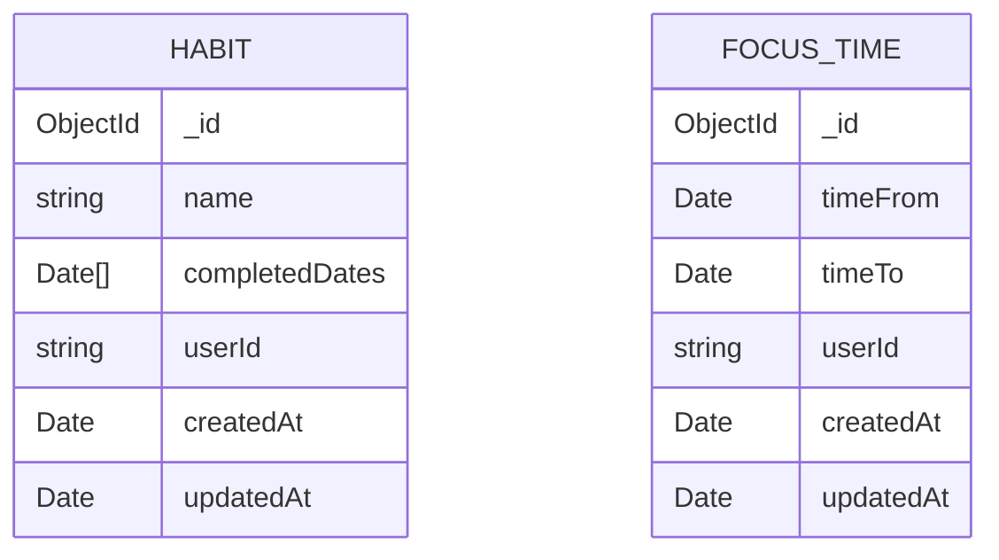

<div align="center">

# 🏆 Elite Tracker — API

**Backend do Elite Tracker: acompanhe hábitos diários e sessões de foco (Pomodoro) com login via GitHub.**


[Sobre](#-sobre) •
[Funcionalidades](#-funcionalidades) •
[Arquitetura](#-arquitetura) •
[Como rodar](#-como-rodar) •
[Endpoints](#-endpoints) •
[Modelos](#-modelos) •
[Frontend](#-frontend)

</div>

---

## 📖 Sobre

A **Elite Tracker API** é uma API REST construída com **Express + TypeScript** e **MongoDB** que dá suporte ao app Elite Tracker. Ela permite que cada usuário:

- cadastre **hábitos diários** e marque/desmarque sua conclusão a cada dia;
- registre **sessões de foco** (ciclos de tempo concentrado);
- consulte **métricas mensais** de hábitos e de foco para alimentar calendários e estatísticas.

A autenticação é feita via **OAuth do GitHub**: a API troca o `code` do GitHub por um token de acesso, busca os dados do usuário e emite um **JWT** próprio, usado nas rotas protegidas.

## ✨ Funcionalidades

| | Recurso | Descrição |
|---|---|---|
| 🔐 | **Login com GitHub** | Fluxo OAuth completo + emissão de JWT |
| ✅ | **Hábitos** | Criar, listar, remover e alternar conclusão do dia |
| 📊 | **Métricas de hábitos** | Dias concluídos de um hábito dentro de um mês |
| ⏱️ | **Tempo de foco** | Registrar sessões com início e fim |
| 📅 | **Métricas de foco** | Quantidade de ciclos por dia no mês (via aggregation pipeline) |
| 🛡️ | **Validação** | Todas as entradas validadas com Zod (retorno `422` em caso de erro) |

## 🧱 Arquitetura


```
src/
├── @types/          # Tipagens (User, extensão do Request do Express)
├── controllers/     # auth, habits e focus-time
├── database/        # Conexão com o MongoDB (mongoose)
├── middlewares/     # Validação do JWT
├── models/          # Schemas do Mongoose (Habit, FocusTime)
├── utils/           # Helpers (mensagens de validação)
├── routes.ts        # Definição das rotas
└── server.ts        # Bootstrap da aplicação (porta 4000)
```

## 🚀 Como rodar

### Pré-requisitos

- [Node.js](https://nodejs.org/) 18+
- Uma instância do [MongoDB](https://www.mongodb.com/) (local, Docker ou Atlas)
- Um [OAuth App no GitHub](https://github.com/settings/developers) com a *callback URL* apontando para a rota `/autenticacao` do frontend

### Passo a passo

```bash
# 1. Clone o repositório
git clone https://github.com/agustinhopneto/dc-elitetracker-api.git
cd dc-elitetracker-api

# 2. Instale as dependências
npm install

# 3. Configure as variáveis de ambiente
cp .env.example .env

# 4. Suba o servidor em modo desenvolvimento
npm run dev
```

O servidor sobe em **http://localhost:4000** 🚀

### Variáveis de ambiente

| Variável | Descrição |
|---|---|
| `MONGO_URL` | String de conexão do MongoDB |
| `GITHUB_CLIENT_ID` | Client ID do OAuth App do GitHub |
| `GITHUB_CLIENT_SECRET` | Client Secret do OAuth App do GitHub |
| `JWT_SECRET` | Segredo usado para assinar os tokens JWT |
| `JWT_EXPIRES_IN` | Tempo de expiração do token (ex.: `1d`) |

> 💡 **Dica:** para subir um MongoDB rapidamente com Docker:
> ```bash
> docker run -d --name mongo -p 27017:27017 mongo
> ```

## 📡 Endpoints

> 🔒 = rota protegida. Envie o header `Authorization: Bearer <token>`.

### Geral e autenticação

| Método | Rota | Descrição |
|---|---|---|
| `GET` | `/` | Nome, descrição e versão da API |
| `GET` | `/auth` | Retorna a `redirectUrl` para o login no GitHub |
| `GET` | `/auth/callback?code=` | Troca o `code` do GitHub por `{ id, name, avatarUrl, token }` |

### Hábitos 🔒

| Método | Rota | Descrição |
|---|---|---|
| `GET` | `/habits` | Lista os hábitos do usuário (ordenados por nome) |
| `POST` | `/habits` | Cria um hábito. Body: `{ "name": "Ler 10 páginas" }` |
| `DELETE` | `/habits/:id` | Remove um hábito |
| `PATCH` | `/habits/:id/toggle` | Marca/desmarca o hábito como concluído **hoje** |
| `GET` | `/habits/:id/metrics?date=` | Datas concluídas do hábito no mês de `date` |

### Tempo de foco 🔒

| Método | Rota | Descrição |
|---|---|---|
| `POST` | `/focus-time` | Registra uma sessão. Body: `{ "timeFrom": "ISO", "timeTo": "ISO" }` |
| `GET` | `/focus-time?date=` | Sessões do dia de `date` |
| `GET` | `/focus-time/metrics?date=` | Quantidade de ciclos por dia no mês de `date` |

<details>
<summary><b>📦 Exemplos de resposta</b></summary>

**`GET /auth/callback`**
```json
{
  "id": "MDQ6VXNlcjEyMzQ1Njc4",
  "name": "Agustinho Neto",
  "avatarUrl": "https://avatars.githubusercontent.com/u/...",
  "token": "eyJhbGciOiJIUzI1NiIs..."
}
```

**`GET /habits/:id/metrics?date=2024-05-01`**
```json
{
  "_id": "6650f1...",
  "name": "Ler 10 páginas",
  "completedDates": ["2024-05-02T03:00:00.000Z", "2024-05-03T03:00:00.000Z"]
}
```

**`GET /focus-time/metrics?date=2024-05-01`**
```json
[
  { "_id": [2024, 5, 2], "count": 3 },
  { "_id": [2024, 5, 3], "count": 1 }
]
```

</details>

### Códigos de status

| Código | Quando |
|---|---|
| `200` / `201` / `204` | Sucesso |
| `400` | Regra de negócio violada (ex.: hábito duplicado, `timeTo` antes de `timeFrom`) |
| `401` | Token ausente ou inválido |
| `404` | Recurso não encontrado |
| `422` | Erro de validação dos dados enviados |

## 🗂️ Modelos



O `userId` é o `node_id` do usuário no GitHub, extraído do JWT.

## 🖥️ Frontend

O frontend que consome esta API está em
👉 **[dc-elitetracker-front](https://github.com/agustinhopneto/dc-elitetracker-front)**

## 🛠️ Tecnologias

- **[Express](https://expressjs.com/)**: framework HTTP
- **[Mongoose](https://mongoosejs.com/)**: ODM para MongoDB
- **[Zod](https://zod.dev/)**: validação de dados
- **[jsonwebtoken](https://github.com/auth0/node-jsonwebtoken)**: emissão e verificação de JWT
- **[Axios](https://axios-http.com/)**: integração com a API do GitHub
- **[Day.js](https://day.js.org/)**: manipulação de datas
- **[tsx](https://github.com/privatenumber/tsx)**: execução de TypeScript com hot reload
- **ESLint + Prettier**: padronização de código

---

<div align="center">

Feito com 💙 por **[Agustinho Neto](https://github.com/agustinhopneto)**

</div>
