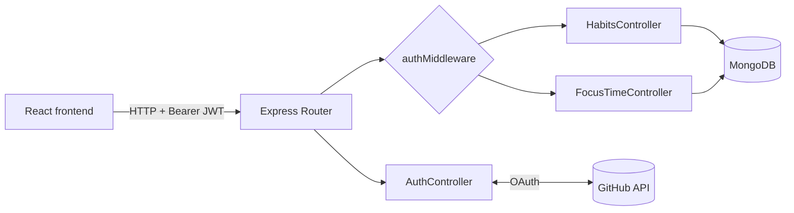
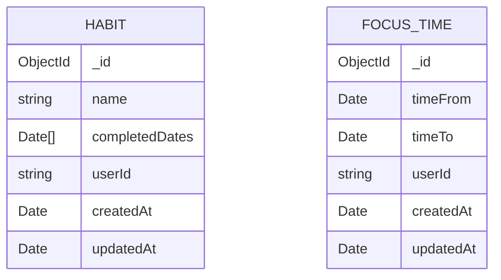

<div align="center">

# 🏆 Elite Tracker: API

**The Elite Tracker backend: track daily habits and focus sessions (Pomodoro) with GitHub sign-in.**


[About](#-about) •
[Features](#-features) •
[Architecture](#-architecture) •
[Getting started](#-getting-started) •
[Endpoints](#-endpoints) •
[Models](#-models) •
[Frontend](#-frontend)

</div>

---

## 📖 About

**Elite Tracker API** is a REST API built with **Express + TypeScript** and **MongoDB** that powers the Elite Tracker app. It lets each user:

- create **daily habits** and mark or unmark them as completed each day;
- record **focus sessions** (cycles of focused time);
- query **monthly metrics** for habits and focus sessions to feed calendars and statistics.

Authentication uses **GitHub OAuth**: the API exchanges the GitHub `code` for an access token, fetches the user’s data and issues its own **JWT**, which is then used on the protected routes.

## ✨ Features

| | Feature | Description |
|---|---|---|
| 🔐 | **GitHub sign-in** | Full OAuth flow + JWT issuing |
| ✅ | **Habits** | Create, list, delete and toggle today’s completion |
| 📊 | **Habit metrics** | Days a habit was completed within a month |
| ⏱️ | **Focus time** | Record sessions with start and end times |
| 📅 | **Focus metrics** | Number of cycles per day in a month (via an aggregation pipeline) |
| 🛡️ | **Validation** | Every input validated with Zod (`422` on error) |

## 🧱 Architecture



```
src/
├── @types/          # Typings (User, Express Request extension)
├── controllers/     # auth, habits and focus-time
├── database/        # MongoDB connection (mongoose)
├── middlewares/     # JWT validation
├── models/          # Mongoose schemas (Habit, FocusTime)
├── utils/           # Helpers (validation messages)
├── routes.ts        # Route definitions
└── server.ts        # App bootstrap (port 4000)
```

## 🚀 Getting started

### Prerequisites

- [Node.js](https://nodejs.org/) 18+
- A [MongoDB](https://www.mongodb.com/) instance (local, Docker or Atlas)
- A [GitHub OAuth App](https://github.com/settings/developers) whose *callback URL* points to the frontend’s `/autenticacao` route

### Step by step

```bash
# 1. Clone the repository
git clone https://github.com/agustinhopneto/dc-elitetracker-api.git
cd dc-elitetracker-api

# 2. Install the dependencies
npm install

# 3. Set up the environment variables
cp .env.example .env

# 4. Start the server in development mode
npm run dev
```

The server runs at **http://localhost:4000** 🚀

### Environment variables

| Variable | Description |
|---|---|
| `MONGO_URL` | MongoDB connection string |
| `GITHUB_CLIENT_ID` | GitHub OAuth App client ID |
| `GITHUB_CLIENT_SECRET` | GitHub OAuth App client secret |
| `JWT_SECRET` | Secret used to sign the JWTs |
| `JWT_EXPIRES_IN` | Token expiration time (e.g. `1d`) |

> 💡 **Tip:** spin up MongoDB quickly with Docker:
> ```bash
> docker run -d --name mongo -p 27017:27017 mongo
> ```

## 📡 Endpoints

> 🔒 = protected route. Send the `Authorization: Bearer <token>` header.

### General and authentication

| Method | Route | Description |
|---|---|---|
| `GET` | `/` | API name, description and version |
| `GET` | `/auth` | Returns the `redirectUrl` for GitHub sign-in |
| `GET` | `/auth/callback?code=` | Exchanges the GitHub `code` for `{ id, name, avatarUrl, token }` |

### Habits 🔒

| Method | Route | Description |
|---|---|---|
| `GET` | `/habits` | Lists the user’s habits (sorted by name) |
| `POST` | `/habits` | Creates a habit. Body: `{ "name": "Read 10 pages" }` |
| `DELETE` | `/habits/:id` | Deletes a habit |
| `PATCH` | `/habits/:id/toggle` | Marks or unmarks the habit as completed **today** |
| `GET` | `/habits/:id/metrics?date=` | Completed dates of the habit in the month of `date` |

### Focus time 🔒

| Method | Route | Description |
|---|---|---|
| `POST` | `/focus-time` | Records a session. Body: `{ "timeFrom": "ISO", "timeTo": "ISO" }` |
| `GET` | `/focus-time?date=` | Sessions on the day of `date` |
| `GET` | `/focus-time/metrics?date=` | Number of cycles per day in the month of `date` |

<details>
<summary><b>📦 Response examples</b></summary>

**`GET /auth/callback`**
```json
{
  "id": "MDQ6VXNlcjEyMzQ1Njc4",
  "name": "Agustinho Neto",
  "avatarUrl": "https://avatars.githubusercontent.com/u/...",
  "token": "eyJhbGciOiJIUzI1NiIs..."
}
```

**`GET /habits/:id/metrics?date=2024-05-01`**
```json
{
  "_id": "6650f1...",
  "name": "Read 10 pages",
  "completedDates": ["2024-05-02T03:00:00.000Z", "2024-05-03T03:00:00.000Z"]
}
```

**`GET /focus-time/metrics?date=2024-05-01`**
```json
[
  { "_id": [2024, 5, 2], "count": 3 },
  { "_id": [2024, 5, 3], "count": 1 }
]
```

</details>

### Status codes

| Code | When |
|---|---|
| `200` / `201` / `204` | Success |
| `400` | Business rule violated (e.g. duplicated habit, `timeTo` before `timeFrom`) |
| `401` | Missing or invalid token |
| `404` | Resource not found |
| `422` | Invalid request data |

## 🗂️ Models



`userId` is the user’s GitHub `node_id`, taken from the JWT.

## 🖥️ Frontend

The frontend that consumes this API lives at
👉 **[dc-elitetracker-front](https://github.com/agustinhopneto/dc-elitetracker-front)**

## 🛠️ Tech stack

- **[Express](https://expressjs.com/)**: HTTP framework
- **[Mongoose](https://mongoosejs.com/)**: MongoDB ODM
- **[Zod](https://zod.dev/)**: data validation
- **[jsonwebtoken](https://github.com/auth0/node-jsonwebtoken)**: JWT signing and verification
- **[Axios](https://axios-http.com/)**: GitHub API integration
- **[Day.js](https://day.js.org/)**: date handling
- **[tsx](https://github.com/privatenumber/tsx)**: runs TypeScript with hot reload
- **ESLint + Prettier**: code style

---

<div align="center">

Made with 💙 by **[Agustinho Neto](https://github.com/agustinhopneto)**

</div>
